# Anomaly Detection Report

## Introduction

This report provides insights into the Personalized Anomaly Detection project, which employs a Neural Stochastic Multi-Modal Point Process (NSMMPP) to identify anomalies in temporal sequences. The goal is to model and detect irregular events in a manner that can be customized for individual sequences or users, focusing on data from an inhomogeneous Poisson process with two contexts.

In the context of this project, the anomalies we are seeking to detect are categorized as either commissions or omissions.

### Inhomogeneous Poisson Process
Example of an Inhomogeneous Poisson process:
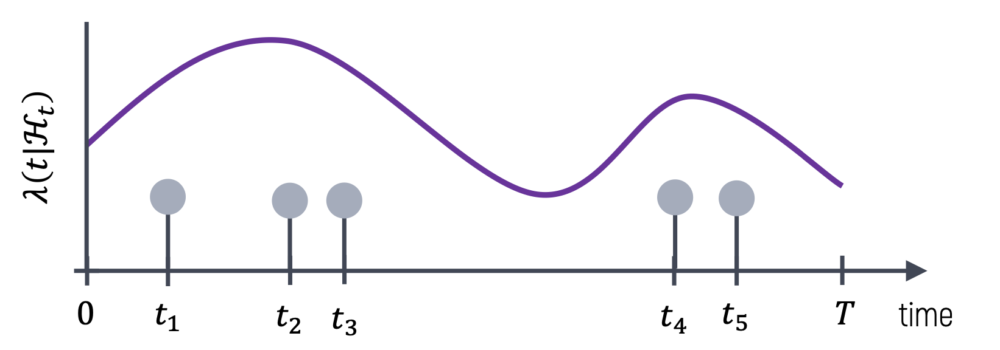

### Commission Outliers
Commission outliers are detected using the following equation:
\[ s_c(t_n) = -λ(t_n) \]
where \( s_c(t_n) \) is the commission outlier score for \( t_n \), indicating the likelihood of being a commission outlier. The commission outlier score represents scenarios where events occur that shouldn’t have occurred.

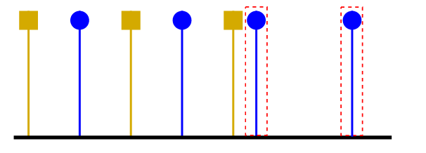

### Omission Outliers
Omission outliers are represented by blank intervals, \( B = (t_b, t_e) \), and are detected using the equation:
\[ s_o(B) = \int_B λ(s)ds \]
This score, \( s_o(B) \), represents scenarios where events that should have occurred are missing.

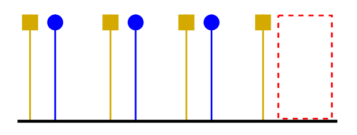

### Estimating CIF (λ) 
Hence, To effectively identify commission and omission outliers, the Cumulative Intensity Function (CIF), denoted as \( \lambda \), is required. For this purpose, the project employs a Continuous-Time Long Short-Term Memory (LSTM) model, designed to capture the temporal dependencies in continuous-time sequence data. CIF is derived from the hidden state of the LSTM.

### Log-Likelihood Function
The optimization of the model and the accuracy of the CIF estimation relies on the maximization of a specific Log-Likelihood function, which serves as the objective function during the training of the Continuous-Time LSTM model.

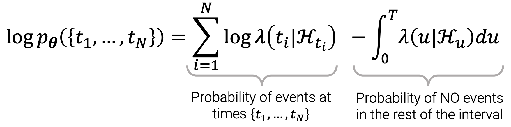

## Data Understanding

### Data Generation Process
The generation of data involves multiple steps to create a realistic representation of individual variability and contextual influences:

1. **CIF Sampling**: For each person, CIF is sampled from a uniform distribution, establishing a foundational intensity function for event occurrence.
2. **Context State Changes**: The changes in the context state, \( x \), are driven by a continuous-time Markov chain, with the transitions determined by a transition matrix, \( Q \).
3. **Event Generation**: Given the context state, \( x \), and the corresponding CIF, events are generated. This forms the data used for training the model.
4. **Outlier Introduction**: Based on predefined probabilities, some events in the testing data are either deleted, to simulate omission outliers, or added, to represent commission outliers.

### Original Data
The original data is derived from an inhomogeneous Poisson process, characterized by two distinct contexts that influence the cumulative intensity function. The data is visualized in the figure below.
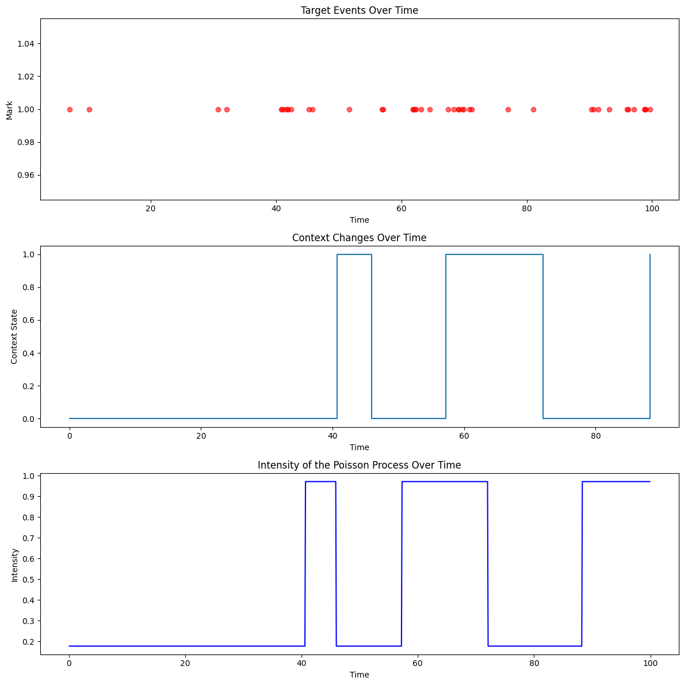

### Input Data without Context
In this project, two types of input data are considered. The first type is without context, meaning the model receives information solely based on the event sequence without any additional contextual information. This approach is visualized in the figure below.

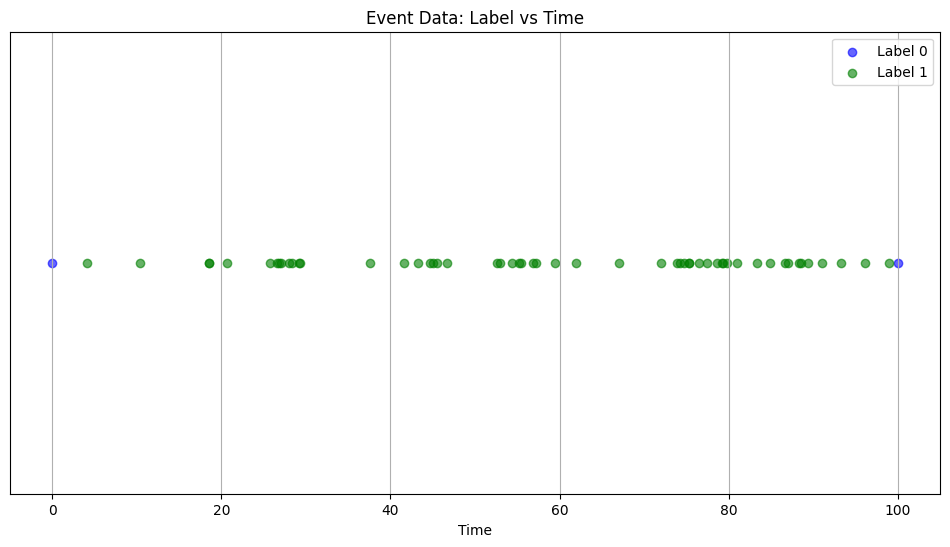

### Input Data with Context
The second type of input data is enriched with context, providing additional information that influences the cumulative intensity function, thereby allowing the model to incorporate these contextual variations during the learning process. The visualization of this context-enriched input data is presented below.

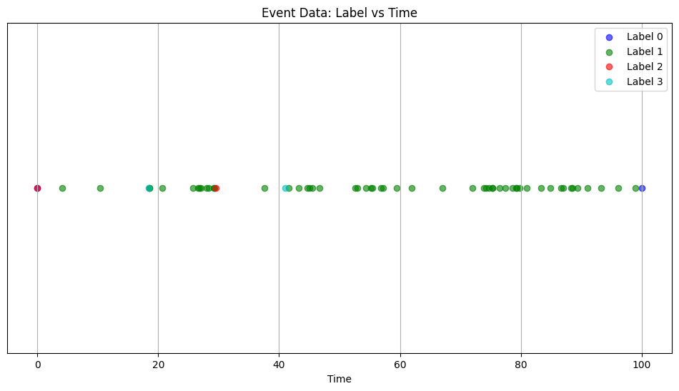

 ## Model Structure

The structure of the model is designed to incorporate multiple aspects of the input data, including the event sequence, personalization through individual embeddings, and contextual information through context embeddings.

### Input Sequence
The input sequence serves as the foundational layer of the model, providing the basic temporal event information that the model will process and learn from.

### Embeddings
1. **Person Embeddings**: These embeddings allow for the personalization of the model by incorporating individual-specific information, enabling the model to adapt and learn the unique patterns and characteristics of each individual's temporal sequences.
2. **Context Embeddings**: These embeddings provide the model with additional contextual information, allowing it to learn and adapt to the different contextual states that can influence the event sequences.

### Model Visualization
The figure below provides a visual representation of the model, illustrating the integration of the input sequence, person and context embeddings, and the LSTM layer.
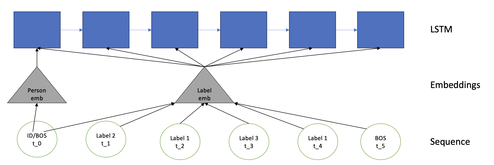

This structured approach enables the model to learn and adapt effectively to the unique characteristics of each individual and the varying contextual influences, enhancing its capability to detect anomalies in the temporal sequences.

## Model Evaluation

### Evaluation Metric: ROC-AUC Score
The model and the baselines are evaluated using the Receiver Operating Characteristic Area Under Curve (ROC-AUC) score. This metric is suitable for assessing the model's capability to distinguish between the normal and anomalous events.

### Models and Baselines
The models evaluated are as follows:
1. **RND**: A baseline model that generates outlier scores by sampling from a uniform distribution, serving as a basic reference for random anomaly detection performance.
2. **LEN**: Another baseline that detects outliers based on the empirical distribution of the inter-event time lengths, providing insights into the anomaly detection performance based on event timing variations.
3. **CPPOD**: This is our proposed model, developed using advanced methodologies to detect anomalies in temporal sequences efficiently and accurately.
4. **GT**: A ground truth model that utilizes CIF information to detect anomalies, serving as an ideal reference for the maximum achievable performance in anomaly detection.

### ROC Plot
The ROC plot below illustrates the performance of each model and baseline, providing a visual comparison of their anomaly detection capabilities.

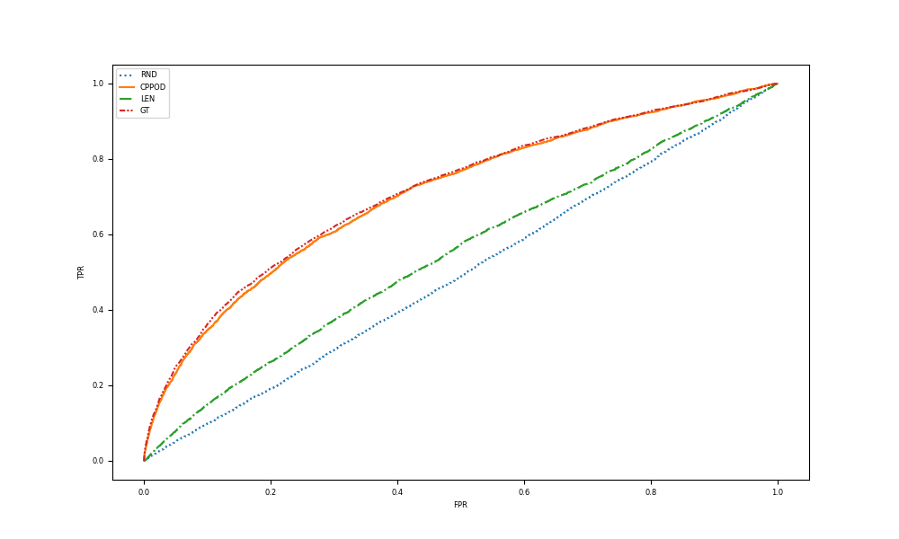
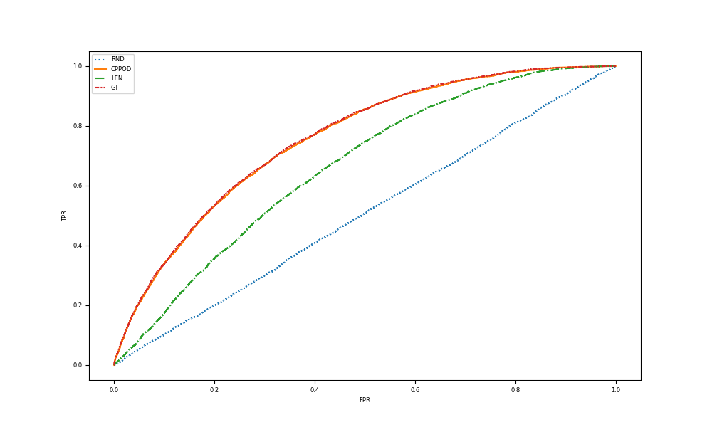

## Experimental Results

Several experiments were conducted to explore various aspects of model performance and to validate certain hypotheses related to personalization and context integration.

### Experiment 1: Impact of Number of Persons on Performance
This experiment investigated how the number of persons impacts the effectiveness of using personalization and/or context in the model.
- **Results**: Context proved to be more crucial than personalization. While employing personalization could enhance both context and non-context models marginally, it showed significance only when the number of persons exceeded 10.
- **Plot**: 
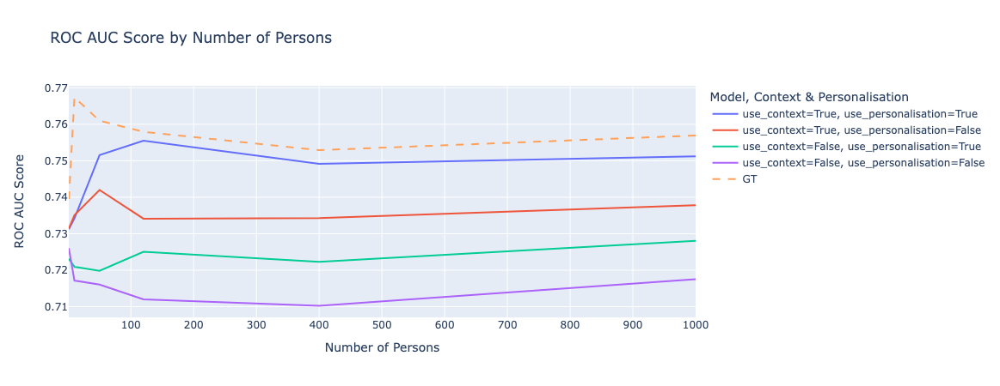

### Experiment 2: Relation between Log-Likelihood and ROC-AUC
This experiment aimed to determine whether maximizing Log-Likelihood would lead to an increase in ROC-AUC.
- **Setup**: blue - nothing, purple - personalisation, green - context, pink - all; loss - validation Log-Likelihood, loss_epoch - training Log-Likelihood.
- **Results**: There was a positive correlation observed, validating the hypothesis that maximizing Log-Likelihood does enhance the ROC-AUC.
- **Plot**: 
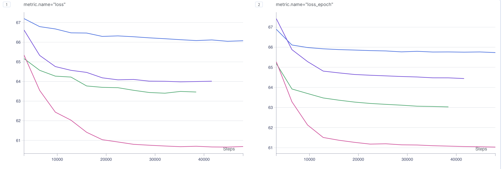

### Experiment 3: Impact of Sequence Count on Personalization Performance
This experiment analyzed whether increasing the number of sequences for each person would affect the performance of personalization.
- **Setup**: 2 persons, non-context
- **Results**: The increase in the number of sequences for each individual did not showcase any notable improvement in personalization performance.
- **Plot**: 
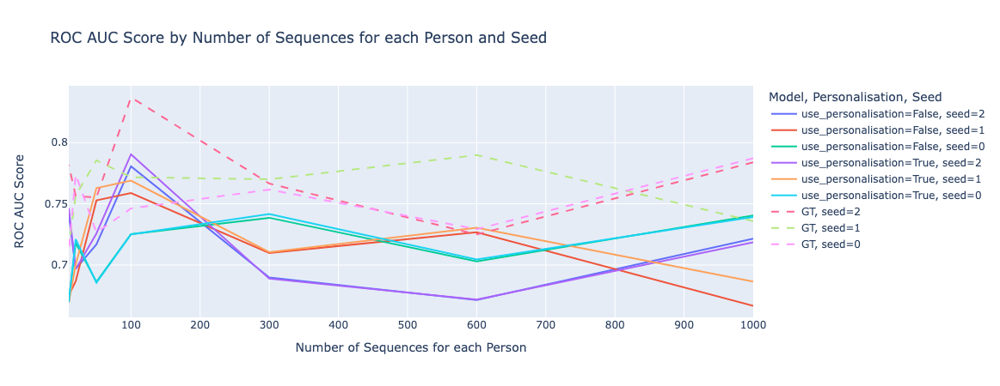

### Experiment 4: Impact of Sequence Length on Personalization Performance
This experiment explored how the number of events in each sequence influences the efficacy of personalization.
- **Setup**: 50 persons
- **Results**: It was observed that with longer sequences for each person, the effect of personalization vanished.
- **Plot**: 
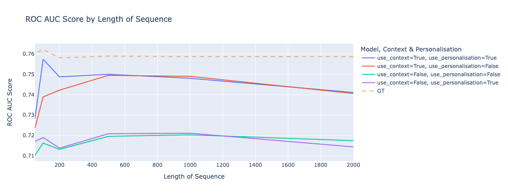

## Conclusion of Experiments
The conducted experiments led to several insightful conclusions regarding the role of context and personalization in the model:
- **Context is Predominant**: The importance of contextual information was found to surpass that of personalization in enhancing model performance.
- **Personalization Insights**: 
  - **Long Sequences**: Personalization does not yield performance improvement for long sequences.
  - **Sequence Count**: The performance of personalization remains unaffected by the increase in the number of sequences per person.
  - **Number of Persons**: Personalization becomes effective only when the number of persons is more than 10.
